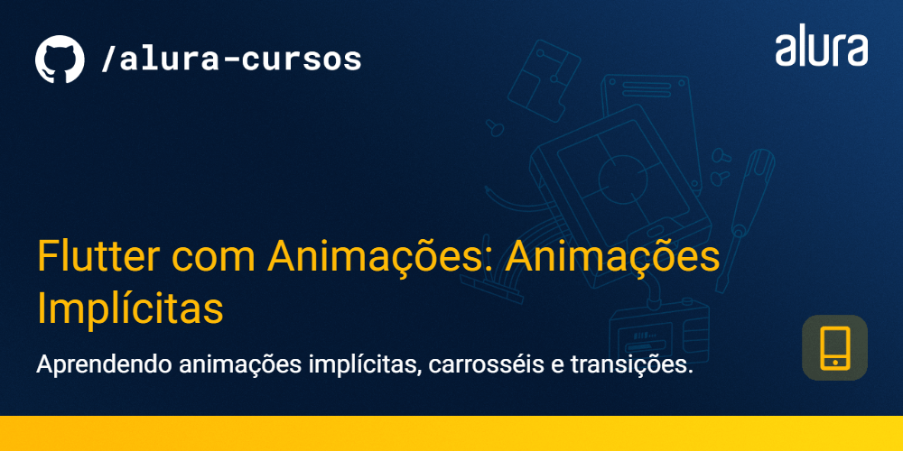
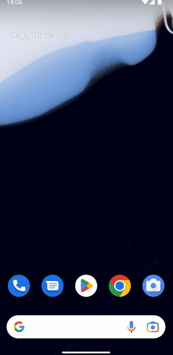

# Flutter com Animações: Animações Implícitas

Projeto Meu Pequeno Grimório para o curso de Flutter com Animações: Animações Implícitas, focado em apresentar soluções da animações para diversos problemas usando Flutter.

### Tópicos abordados no curso:

- Como criar uma Splash Screen nativa;
- Como animar uma tela de Splash;
- O que são Curvas e Interpolação no contexto dos widgets de Animação Implícita;
- Usar carrossel para criar uma tela de onboarding;
- Usar Lottie para animações complexas;
- Como animar a transição entre telas;

Este curso é indicado para pessoas que já tem conhecimento intermediário e querem aprofundar seu conhecimento em Flutter, seguindo boas práticas e também entendendendo como funciona animações dentro dos padrões mobile.

## 📑 Requisitos

- Conhecimentos intermediários de Flutter e Dart;
- Android Studio ou VS Code (com plugins do Flutter e Dart instalados);
- É importante ter o Flutter na versão 3.10.2.

## ✨ Funcionalidades do projeto

- Instalar Splash Screen nativa;
- Animar Splash Screen;
- Usar carrosséis;
- Animar elementos com Lottie;
- Animar transição entre telas;

  

 

## 🛠️ Abrir e rodar o projeto

Aqui vem um passo a passo para abrir e rodar o projeto.

- **Open an Existing Project** (ou alguma opção similar)
- Procure o local onde o projeto está e o selecione (Caso o projeto seja baixado via zip, é necessário extraí-lo antes de procurá-lo)
- Por fim clique em OK
- Depois basta rodar o comando `flutter run` na pasta do projeto